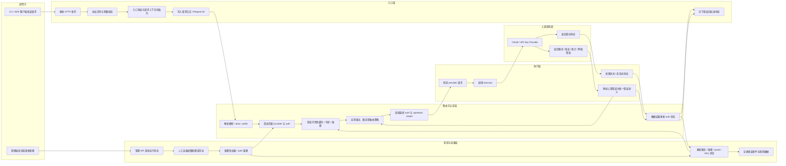

# CLIProxyAPI 全局业务泳道图

本文档定义项目的全局业务泳道图，覆盖 CLIProxyAPI 从请求进入、认证与路由、上游执行、状态回写到运维治理的主业务闭环。

适用对象：
- 产品经理：理解系统的主业务链路和关键决策点
- 开发与测试：统一“请求为什么成功 / 失败 / 快速失败”的语义口径
- 运维：定位问题发生在入口、路由、上游执行还是状态治理层

## 业务边界

CLIProxyAPI 的全局业务可以归纳为两条主线：

1. 在线请求主链路
   客户端发起模型请求，系统完成协议适配、认证、模型路由、上游调用与响应回传。
2. 运行时治理回路
   系统根据上游结果持续更新 auth 可用性、限流状态、熔断状态、配置热加载和运维控制面。

## 核心泳道

- 调用方：Claude Code / Codex / Gemini CLI / OpenAI 兼容客户端 / 管理端调用者
- 入口层：HTTP API、协议适配、请求校验、入口鉴权、请求日志
- 路由与认证层：模型解析、auth 选择、可用性判断、冷却 / 熔断 / 重试决策
- 执行层：各 provider executor、协议转换、流式 / 非流式执行
- 上游提供商：Claude / OpenAI / Gemini / Qwen / OpenAI-compatible provider
- 状态与运维层：状态存储、配置热加载、管理 API、日志与错误事件

## 全局业务泳道图

## 主链路说明

### 1. 请求进入

- 调用方通过 `/v1/chat/completions`、`/v1/messages`、`/v1/responses` 等入口发起请求。
- 入口层负责：
  - 协议识别
  - 模型字段与 payload 基本校验
  - 入口鉴权
  - Request ID、请求日志和上下文初始化

### 2. 模型与 auth 路由

- 路由与认证层负责：
  - 解析模型名、别名、前缀和 reasoning suffix
  - 找到候选 provider / auth / upstream model
  - 检查当前 auth 是否被禁用、冷却、熔断或短时抑制
  - 应用请求重试、凭证重试、provider-rate-limit、auth 级 429 路由策略和模型路由策略

### 3. 上游执行

- 执行层使用 provider executor 发起真实上游请求。
- 上游返回成功时：
  - 透传或转换响应
  - 更新 auth / model 成功状态
  - 关闭或恢复熔断、清理短期失败状态
- 上游返回失败时：
  - 分类为限流、鉴权失败、模型不支持、网络错误、能力不兼容等
  - 更新 auth / model 的可用性状态
  - 由路由层决定是否重试、等待冷却或快速失败

## 治理回路说明

### 1. 状态更新

- 每次执行结果都会回写运行时状态：
  - `auth` 级状态
  - `model` 级状态
  - quota / cooldown
  - circuit breaker
  - availability suppression

### 2. 观测与管理

- 请求日志记录入口信息、上游请求、上游响应和最终响应。
- 错误事件与状态存储用于后续查询、治理和自动化处理。
- 管理 API 负责查看运行状态、修改配置、触发热加载和运维操作。

### 3. 配置热加载

- 配置文件或 auth 文件变化后，watcher 会触发热加载。
- 热加载会影响：
  - provider 列表
  - auth 候选集
  - 模型别名与路由
  - 限流、熔断和重试参数

## 关键业务决策点

- 请求入口是否通过鉴权
- 模型是否能解析到候选 provider / auth
- 候选 auth 当前是否可用
- 上游错误是否属于可重试类型
- 429 后应等待当前 auth、经过一个 cooldown window 再切换候选 auth，还是直接快速失败
- 是否命中 availability suppression
- 配置更新后是否应恢复原先不可用的 auth / model

## 代码映射

- 入口层：`internal/api/`
- 路由与认证层：`sdk/cliproxy/auth/`
- 执行层：`internal/runtime/executor/`
- 配置与热加载：`internal/config/`、`internal/watcher/`
- 状态与存储：`internal/store/`、`internal/registry/`

## 相关文档

- 专项治理流程：[../产品经理业务流程说明.md](../产品经理业务流程说明.md)
- 227 production deployment: [deploy-ssh-227.md](deploy-ssh-227.md)
- HK production deployment: [deploy-ssh-hk.md](deploy-ssh-hk.md)
