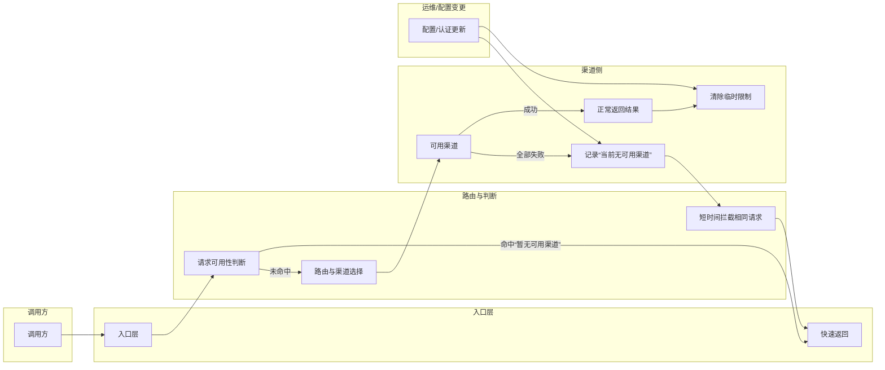

# hk 环境重复无效请求治理流程说明

这是一个专项治理文档，不是项目全局业务泳道图。

- 全局业务泳道图请参考：[technical/global-business-swimlane.md](technical/global-business-swimlane.md)
- 本文仅聚焦 hk 环境中的“重复无效请求治理”和“长请求超时治理”。

目标：减少同一会话、同一模型、同一入口凭证在“渠道已不可用”时反复重试造成的噪音，并让系统更快返回明确结果。

本说明同时覆盖 hk 环境长请求超时治理：区分“下游断开导致的取消”和“服务端请求预算耗尽”，避免把两类问题都误判为上游渠道不可用。

## 核心业务流程

1. 调用方发起请求，携带模型、入口凭证和会话标识。
2. 系统先判断这组请求条件近期是否已经被确认“暂无可用渠道”。
3. 如果已确认过，系统直接快速返回“暂无可用渠道”，不再继续向外尝试。
4. 如果没有命中，系统按现有路由策略寻找可用渠道并发起请求。
5. 如果上游返回 429，系统先按 auth 级策略判断：是等待当前 auth 冷却后重试，还是在经过一个冷却窗口后才允许切换到同模型的其他候选。
6. 如果某个渠道可用，请求正常返回，同时清除这组条件的临时限制状态。
7. 如果所有候选渠道都不可用，系统记录这次结果，并在短时间内对相同条件的后续请求做快速拦截。
8. 当配置、认证文件或可用性状态发生更新后，系统会恢复再次尝试的机会。

## 长请求超时治理流程

1. 调用方发起长推理或大上下文请求。
2. 非流式请求在等待上游期间按 `nonstream-keepalive-interval` 写入空行，避免中间链路把连接当成空闲连接断开。
3. 如果下游客户端、网关或反向代理先断开，系统记录 `Error Category: context_canceled` 与 `Cancel Source: downstream_cancelled`。
4. 如果服务端总预算耗尽，系统返回 `upstream_timeout: upstream request budget exceeded`，并记录 `Error Category: request_budget_exceeded` 与 `Cancel Source: request_budget`。
5. 运维侧根据日志分类决定处理方向：下游取消优先调客户端/网关超时，预算耗尽优先调上游稳定性、请求预算和重试策略。

## hk 生产配置口径

- `request-retry: 4`：保留 auth/credential 级兜底，不做过度重试。
- `request-budget-seconds: 300`：单请求总预算，覆盖执行、重试和冷却等待。
- `max-retry-interval: 30`：避免冷却等待长时间吞掉总预算。
- `nonstream-keepalive-interval: 5`：非流式请求等待上游时每 5 秒写空行保活。
- `N卡 -> 429-routing-policy: failover_after_cooldown_window`：上游 429 先触发本 auth 冷却与重试，不再立即切到别的同模型 provider。

## 泳道图

## 业务结果

- 可用时，正常返回。
- 不可用时，第一次给出真实失败。
- 紧接着的重复请求，改为快速失败，避免继续消耗渠道和日志。
- 配置更新后，可恢复重新尝试。
- 长请求超时时，日志能直接区分下游取消和请求预算耗尽，降低误判与重复排查成本。
